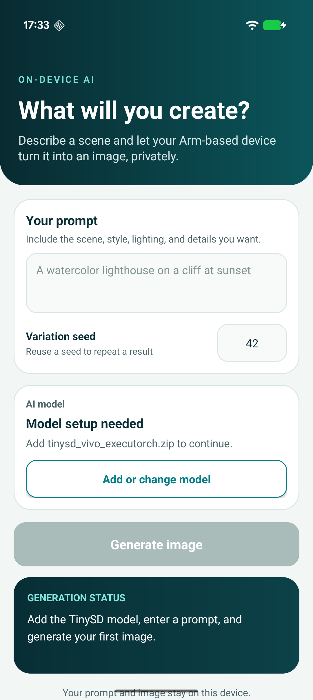
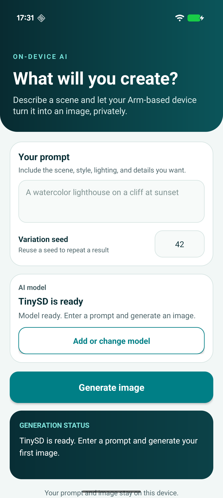
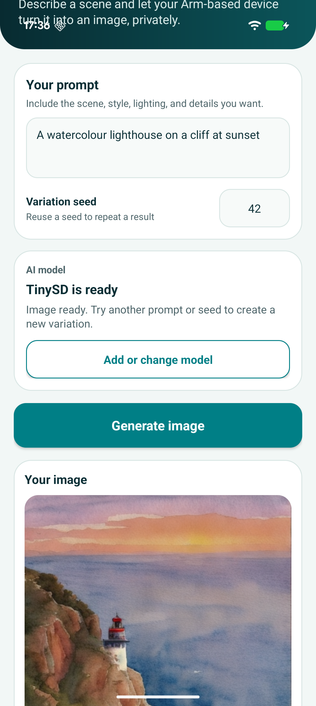
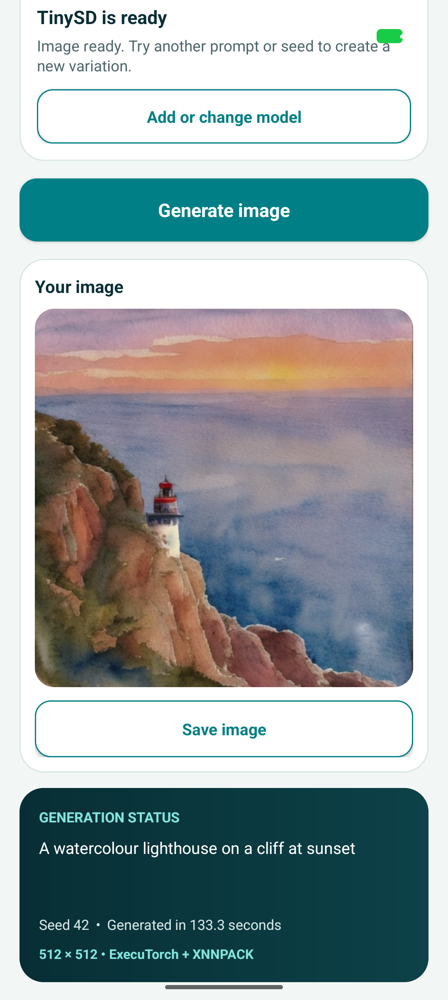

# TinySD Studio Android application

This example application accompanies the [Arm Learning Path for running image generation models from the Arm AI Portal](https://learn.arm.com/learning-paths/mobile-graphics-and-gaming/ai-portal-tinysd-android). It is intended for learning how models run on devices and is not a reference production application. It is provided under the [Arm Education End User License Agreement](LICENSE.md).

TinySD Studio runs an Arm-optimized TinySD text-to-image model locally on an Arm64 Android phone or emulator. It uses ExecuTorch with XNNPACK to generate a 512 × 512 image from a text prompt. The prompt and generated image remain on the Android device.

The application imports the model artifacts at run time, so the approximately 1 GB ExecuTorch program is not stored in the Android application package (APK).

## Application views

<p align="center">
  
  
  
  
</p>

The application imports the optimized model bundle, accepts a prompt and variation seed, reports generation progress and elapsed time, and saves the generated image through Android's document picker.

## Requirements

- Android Studio with Android SDK 35
- Java 17, supplied by Android Studio
- An Arm64 Android device running Android 9, API level 28, or later
- At least 7 GB of memory exposed to the application; configure an Android Virtual Device (AVD) with 8192 MB of RAM
- At least 3 GB of available storage while downloading and importing the model
- Python 3 and the `huggingface_hub` package for the supplied model downloader

An x86-64 Android emulator cannot run this Arm64-only application. Use a physical Arm64 phone when developing on an Intel or AMD computer.

## Supported model

| Model | Runtime | Hugging Face repository | Import this file |
| --- | --- | --- | --- |
| TinySD INT8 | ExecuTorch with XNNPACK | [`Arm/tiny-sd-int8-xnnpack-executorch-vivo-x300`](https://huggingface.co/Arm/tiny-sd-int8-xnnpack-executorch-vivo-x300) | `tinysd_vivo_executorch.zip` |

The repository contains both INT8 and FP32 ExecuTorch programs. The downloader packages only the smaller INT8 program and its required tokenizer and scheduler data for this application.

The application registers this package through `CompatibleModelRegistry.java` and runs it through the supplied `TinySdImageGenerationAdapter.java` adapter.

## Download and package the model

Create a Python virtual environment and install the Hugging Face Hub package.

On macOS or Linux:

```bash
python3 -m venv .hf-venv
source .hf-venv/bin/activate
python -m pip install --upgrade huggingface_hub
```

On Windows PowerShell:

```powershell
py -m venv .hf-venv
.\.hf-venv\Scripts\Activate.ps1
python -m pip install --upgrade huggingface_hub
```

Run the included downloader from the repository root. The `--print-path` option returns the generated archive path for later commands.

On macOS or Linux:

```bash
MODEL_ID="Arm/tiny-sd-int8-xnnpack-executorch-vivo-x300"
MODEL_FILE="$(python download_model.py \
  --repo-id "$MODEL_ID" \
  --print-path)"

printf 'Model archive: %s\n' "$MODEL_FILE"
```

On Windows PowerShell:

```powershell
$MODEL_ID = "Arm/tiny-sd-int8-xnnpack-executorch-vivo-x300"
$MODEL_FILE = python download_model.py `
  --repo-id "$MODEL_ID" `
  --print-path

Write-Output "Model archive: $MODEL_FILE"
```

If the Hugging Face repository requires authentication, sign in and repeat the download:

```console
hf auth login
```

The downloader retrieves only these files:

| Repository file | Application role |
| --- | --- |
| `tiny-sd-int8-executorch.pte` | Multimethod ExecuTorch program containing `text_encoder`, `unet`, and `vae_decoder` |
| `schedule_data.json` | Constants for the 25-step DPM-Solver++ denoising loop |
| `tokenizer/tokenizer.json` | CLIP vocabulary and byte-pair encoding rules |

It packages them as `downloads/tinysd_vivo_executorch.zip` using the entry names and uncompressed ZIP format required by the Android importer.

Copy the archive to the Android **Downloads** directory through ADB:

```console
adb push "$MODEL_FILE" /sdcard/Download/tinysd_vivo_executorch.zip
```

You can instead use Android Studio's **Device Explorer** to upload the archive to `/sdcard/Download/`.

## Open and run the application

1. Clone or download this repository.
2. Open the repository root in Android Studio.
3. Wait for Gradle sync to finish.
4. Connect an Arm64 Android phone or start a compatible Arm64 AVD.
5. Select the `app` configuration and run it.
6. Select **Import TinySD model** and choose `tinysd_vivo_executorch.zip` from **Downloads**.
7. Wait until the application reports **Model ready**.
8. Enter a text prompt and a whole-number variation seed.
9. Select **Generate image**.
10. Select **Save image** to save the generated PNG through Android's document picker.

The seed controls the initial random noise. Reusing the same model, prompt, and seed reproduces the same image. Change the seed to create another variation of the prompt.

The application extracts the required artifacts into its private app-specific storage. Clearing the application data or uninstalling the application removes the imported model. The original ZIP remains in the Android **Downloads** directory.

## Application structure

`MainActivity.java` connects the Android document picker, prompt and seed controls, model status, generation progress, generated image, and save action. It selects the model descriptor from `CompatibleModelRegistry.models()` and obtains the matching compiled adapter from `AdapterRegistry.java`. Model import and generation run on a background executor so the Android user interface remains responsive.

The application currently supplies one adapter:

- `TinySdImageGenerationAdapter.java` provides the TinySD ExecuTorch image-generation workflow. It owns package readiness and import, tokenizer and runner initialization, generation, progress callbacks, and model cleanup.

The remaining files separate the reusable application structure from the TinySD implementation:

- `ImageGenerationAdapter.java` defines the application-facing contract for model readiness, import, generation, and cleanup.
- `ModelDescriptor.java` describes a supported package, including its model ID, adapter ID, archive name, runtime, storage directory, memory requirement, and required files.
- `CompatibleModelRegistry.java` declares the model packages supported by the application. It currently contains one TinySD INT8 descriptor.
- `AdapterRegistry.java` registers the adapters compiled into the APK and resolves a descriptor's adapter ID.
- `ModelImporter.java` checks the required ZIP entries, sizes, and checksums in a staging directory before replacing the installed model files.
- `ClipTokenizer.java` converts the prompt into the CLIP token sequence used by the text encoder.
- `ScheduleData.java` loads the exported denoising constants.
- `TinySdRunner.java` memory-maps the `.pte` program and runs the text encoder, denoising loop, and VAE decoder.
- `download_model.py` downloads only the required Hugging Face artifacts and creates the import archive.

The expected archive filename is displayed by the application and produced by `download_model.py`. The importer accepts an archive based on its required entries and checksums, rather than its selected filename. The ExecuTorch method contract is checked when the model is first loaded for generation.

TinySD is exported as one multimethod ExecuTorch program. `TinySdRunner` calls `text_encoder` for the prompt and unconditional input, calls `unet` for conditioned and unconditioned predictions during each denoising step, and calls `vae_decoder` to create the final RGB image.

## License

This project is provided under the [Arm Education End User License Agreement](LICENSE.md).
